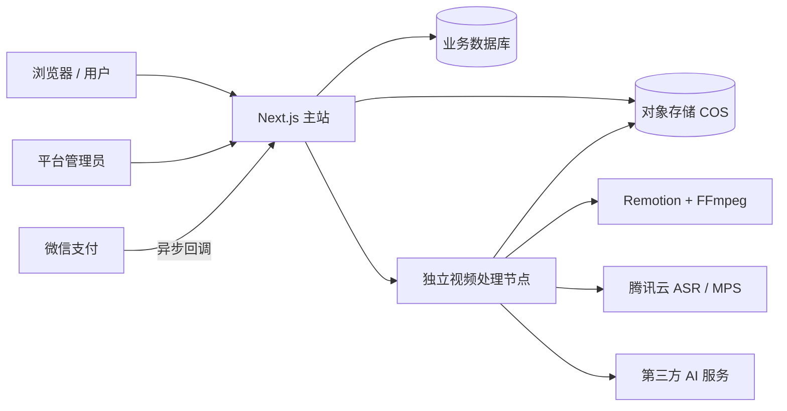

# 爆点实验室（Merchant Studio）

面向商家和内容创作者的一站式 AI 内容生产平台。项目包含用户工作台、管理后台、会员与积分、微信支付、市场动态、图片创作、短视频工具，以及可独立扩容的视频渲染服务。

> 当前仓库仍处于“开源准备”阶段。项目许可证和第三方商业素材的再分发授权尚未全部确认；正式公开前请先阅读 [开源发布指南](docs/OPEN_SOURCE_GUIDE.md)。

## 功能概览

| 模块 | 主要能力 |
| --- | --- |
| 图片设计 | 营销海报、朋友圈素材、门店物料和行业图片 |
| 短视频 | 素材智能成片、AI 超级剪辑、对口型视频、一键网感 |
| 网感模板 | 模板 9–12，支持字幕、标题、关键词、音效、BGM 和画面变化 |
| 市场动态 | 对标账号监控、公开作品列表、作品链接和数据趋势 |
| 会员资产 | 统一管理图片、视频、剪辑成片、封面和声音资产 |
| 会员与支付 | 邀请码注册、积分账户、充值与消费记录、微信 Native 支付 |
| 管理后台 | 会员、邀请码、模板、积分规则、AI 服务和支付配置 |

## 系统架构



- **主站**：处理页面、API、会员、积分、支付、市场动态和会员资产。
- **视频节点**：处理上传、音视频探测、语音识别、AI 编排、Remotion/FFmpeg 渲染和产物上传。
- **对象存储**：保存用户上传素材和生成结果；不建议长期存放在主站系统盘。
- **业务数据**：开发环境可使用 SQLite；面向多用户的生产环境建议迁移到托管 MySQL/PostgreSQL。

详细设计见 [项目架构](docs/PROJECT_ARCHITECTURE.md) 和 [云服务器架构实施计划](docs/CLOUD_DEPLOYMENT_PLAN.md)。

## 技术栈

- Next.js 16、React 19、TypeScript、Tailwind CSS
- Python 视频任务服务
- Remotion、FFmpeg
- 腾讯云 COS、ASR、MPS
- 微信支付 APIv3（普通商户直连 Native 支付）
- GitHub Actions 自动构建与发布

## 目录结构

```text
app/                         Next.js 页面、管理后台和服务端 API
lib/                         数据库、会员、积分、支付和第三方服务逻辑
public/ai-explainer/         AI 超级剪辑前端
services/video-worker/       视频任务、语音识别和渲染调度服务
services/remotion-worker/    模板 9–12 的 Remotion/FFmpeg 渲染器
deploy/                      主站和独立渲染节点的部署脚本与示例
docs/                        架构、部署、安全和模板规则文档
tests/                       主站冒烟测试
```

## 本地运行

### 环境要求

- Node.js `22.13.0` 或更高版本
- pnpm `11.16.0`
- 需要本地视频渲染时，另行准备 Python、FFmpeg 和 Chromium/Chrome Headless Shell

### 启动主站

```bash
cp .env.example .env.local
corepack enable
pnpm install --frozen-lockfile
pnpm run dev
```

`.env.local` 只填写本地或测试凭证，不要提交到 Git。未配置第三方服务时，相关能力不可用属于正常现象。

### 代码检查

```bash
pnpm run typecheck
pnpm run lint
pnpm run build
```

视频服务的具体依赖和启动方式见 [services/video-worker/README.md](services/video-worker/README.md) 与 [services/remotion-worker/README.md](services/remotion-worker/README.md)。

## 生产部署

推荐使用“两台服务器 + 对象存储”的最小生产架构：

1. 主站服务器：运行 Next.js、反向代理和业务数据库连接。
2. 独立渲染服务器：运行视频任务服务、Remotion、FFmpeg 和浏览器渲染环境。
3. 腾讯云 COS：保存输入素材和生成产物。
4. GitHub Actions：完成检查、构建、增量发布、健康检查和失败回滚。

完整的规格、网络、安全组、环境变量、部署步骤、验收和扩容方案见 [云服务器架构实施计划](docs/CLOUD_DEPLOYMENT_PLAN.md)。

## 密钥与隐私

- 真实 API Key、SecretId、SecretKey、支付私钥、APIv3 密钥、证书、数据库和用户文件不得提交。
- 服务器凭证只存放在服务器受限目录、密钥管理服务或 GitHub Environment Secrets。
- 浏览器端不得出现第三方平台密钥；由服务端代理并执行权限、限流和计费。
- 微信支付必须验签、解密回调，并通过唯一订单号保证积分只入账一次。
- 如果任何真实密钥曾进入 Git 历史，删除文件并不足够，必须立即吊销并轮换。

详见 [安全策略](SECURITY.md)。

## 开源与素材说明

本项目可能引用用户自购字体、音效、BGM、视频或模板素材。“允许商用”不等于“允许公开再分发”。公开仓库前应：

1. 只保留许可证允许再分发的资源；
2. 为可再分发资源保留许可证和来源记录；
3. 将其余资源替换成占位符或由部署者自行提供；
4. 对用户上传内容、声音克隆和公开视频采集取得合法授权。

第三方资源检查清单见 [第三方素材说明](docs/THIRD_PARTY_ASSETS.md)。

## 相关文档

- [项目架构](docs/PROJECT_ARCHITECTURE.md)
- [云服务器架构实施计划](docs/CLOUD_DEPLOYMENT_PLAN.md)
- [CDN 媒体全量迁移实施计划](docs/CDN_MEDIA_MIGRATION_PLAN.md)
- [产品设计规范](DESIGN.md)
- [自动部署说明](docs/AUTOMATIC_DEPLOYMENT.md)
- [开源发布指南](docs/OPEN_SOURCE_GUIDE.md)
- [安全策略](SECURITY.md)
- [参与贡献](CONTRIBUTING.md)
- [模板资源隔离规则](docs/template-isolation-rule.md)

## 许可证

仓库暂未声明开源许可证。在选择许可证并完成第三方素材清理前，默认不授予复制、修改或再分发权。建议结合商业模式在 Apache-2.0、MIT 或 AGPL-3.0 中明确选择一种，并在根目录加入正式 `LICENSE` 文件。
