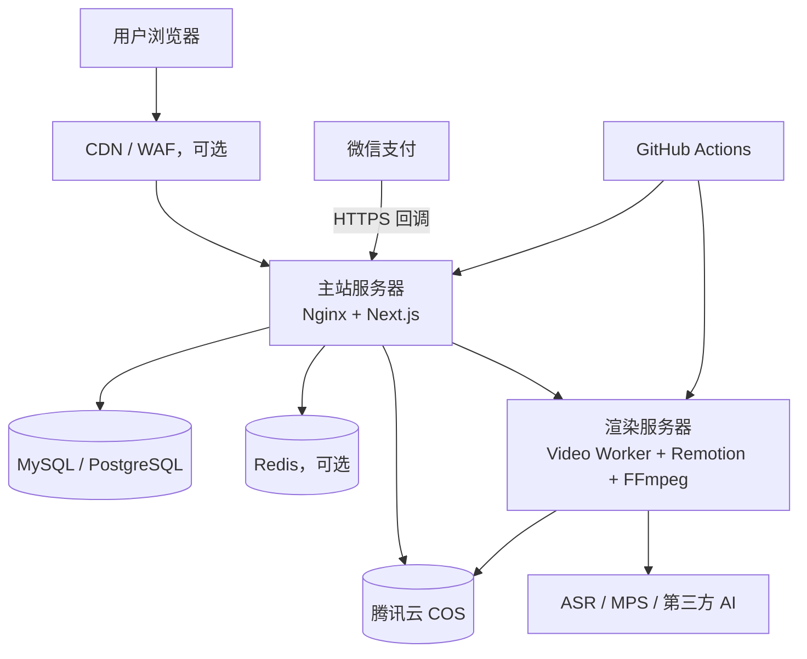

# 云服务器架构实施计划

本文供首次部署者使用。所有域名、内网地址、账号和密钥均为占位符，不包含项目所有者的真实生产信息。

## 1. 部署目标

- 主站和视频渲染解耦，渲染高负载不影响登录、支付和会员数据。
- 用户素材与生成产物进入对象存储，服务器只保留短期工作文件。
- 所有第三方凭证仅在服务端使用，不进入浏览器、镜像或 Git。
- 支持健康检查、失败回滚、备份、监控和后续横向扩容。

## 2. 推荐架构

## 3. 最小生产规格

| 资源 | 建议规格 | 用途 |
| --- | --- | --- |
| 主站服务器 | 4 核 8 GB、SSD 100 GB、5–10 Mbps | Next.js、Nginx、业务 API |
| 渲染服务器 | 8 核 16 GB、SSD 180–270 GB、12–18 Mbps | FFmpeg、Remotion、语音识别和视频任务 |
| 对象存储 | 与服务器同地域的 COS | 输入素材、生成视频、封面和下载 |
| 数据库 | 托管 MySQL/PostgreSQL，最小可从 2 核 4 GB 起 | 会员、订单、积分、资产和业务数据 |
| Redis | 1 GB 起，可选 | 分布式任务队列、锁、限流和缓存 |

开发或低流量试运行可继续使用 SQLite，但多实例部署前必须迁移到集中式数据库。渲染并发不要只按内存估算；CPU、浏览器实例和 FFmpeg 编码通常先成为瓶颈。

## 4. 域名与网络

示例域名：

- `studio.example.com`：用户工作台、管理后台和 API。
- `media.example.com`：COS/CDN 下载域名，可选。
- 渲染服务不直接暴露给互联网；主站通过同 VPC 内网地址访问，例如 `http://10.0.0.20/video-worker`。

安全组最小规则：

| 目标 | 端口 | 来源 |
| --- | --- | --- |
| 主站 Nginx | 80/443 | 互联网或 CDN 回源地址 |
| 主站 SSH | 自定义 SSH 端口 | 管理员固定 IP / GitHub Actions 出口方案 |
| 渲染服务 | 仅内部监听端口 | 主站内网 IP |
| 渲染 SSH | 自定义 SSH 端口 | 管理员固定 IP / 部署通道 |
| 数据库 | 数据库端口 | 主站内网安全组 |

不对公网开放数据库、Redis、视频 Worker 原始端口或监控管理端口。

## 5. 密钥分层

### GitHub Environment Secrets

仅保存部署通道所需信息：

- `TENCENT_SSH_HOST`
- `TENCENT_SSH_PORT`
- `TENCENT_SSH_USER`
- `TENCENT_SSH_PRIVATE_KEY`
- `TENCENT_SSH_KNOWN_HOSTS`
- `VIDEO_WORKER_SSH_KNOWN_HOSTS`

GitHub Environment Variables：

- `VIDEO_WORKER_SSH_HOST`
- `VIDEO_WORKER_SSH_PORT`
- `VIDEO_WORKER_SSH_USER`
- `VIDEO_WORKER_UPSTREAM_URL`
- `PUBLIC_HEALTHCHECK_URL`
- `PUBLIC_VIDEO_WORKER_HEALTHCHECK_URL`

### 主站服务器环境变量

按 `.env.example` 填写，主要包括：

- 应用数据目录与管理员初始化配置
- AI 平台、数字人和市场动态服务的服务端凭证
- `VIDEO_WORKER_UPSTREAM_URL` 与 `VIDEO_WORKER_ADMIN_TOKEN`
- 腾讯云 COS/MPS 凭证
- 微信支付商户号、AppID、APIv3 密钥、证书序列号、私钥路径、公钥/平台证书路径和回调地址

### 渲染服务器环境变量

按 `services/video-worker/.env.example` 填写，主要包括：

- 工作目录、并发、保留周期和编码参数
- 与主站相同的 `VIDEO_WORKER_ADMIN_TOKEN`
- AI、ASR、MPS、COS 服务端凭证
- 公开产物地址和允许访问的主站 Origin

原则：环境变量样例只写变量名和占位符；证书放在 `/etc/merchant-studio/secrets/` 等受限目录，权限建议目录 `700`、私钥 `600`。

## 6. 实施步骤

### 阶段 A：云资源

1. 在同一地域和 VPC 创建主站、渲染服务器、COS、数据库。
2. 建立内网安全组关系，只允许主站访问渲染和数据库。
3. 配置 COS 私有读写、跨域、生命周期和 CDN（可选）。
4. 创建最小权限 CAM 子账号或角色，不使用主账号永久密钥。

### 阶段 B：基础系统

1. 使用 Ubuntu 24.04 LTS，更新安全补丁。
2. 创建独立部署用户，关闭 SSH 密码登录和 root 远程登录。
3. 安装 Nginx、Node.js、pnpm，以及渲染节点所需的 Python、FFmpeg、字体和浏览器依赖。
4. 创建持久化目录、日志目录、临时工作目录和密钥目录。
5. 配置系统时间、日志轮转、磁盘告警和自动安全更新。

### 阶段 C：主站

1. 参考 `deploy/install-web-server.sh` 和 `deploy/merchant-studio-web.service` 安装服务。
2. 将 `.env.example` 复制为服务器私有 `.env.local` 并填写真实配置。
3. 配置 Nginx、HTTPS、上传大小、超时和安全响应头。
4. 初始化数据库与管理员账号，关闭演示账号。
5. 验证 `/api/health`、登录、会员资产和管理后台。

### 阶段 D：渲染节点

1. 参考 `deploy/bootstrap-video-worker-deploy.sh` 安装独立部署服务。
2. 安装 `services/video-worker` 与 `services/remotion-worker` 依赖。
3. 配置视频工作目录、COS、ASR、AI 服务和管理 Token。
4. 先把并发设为 1，完成模板 9–12 冒烟测试后再逐步提高。
5. 验证上传、识别、渲染、产物回传、下载和过期文件清理。

### 阶段 E：微信支付

1. 使用普通商户直连 Native 支付配置。
2. 私钥和平台公钥/证书只存服务器密钥目录。
3. 回调地址必须为公网 HTTPS，例如 `https://studio.example.com/api/pay/wechat/notify`。
4. 验证签名、解密通知、金额、商户号和订单状态。
5. 使用数据库唯一约束或事务保证同一支付通知只能入账一次。
6. 完成一笔小额支付、重复回调、失败支付、退款和对账测试。

### 阶段 F：自动部署

1. 在 GitHub 创建 `production` Environment 并配置受保护 Secrets。
2. 为主站和渲染节点使用不同部署密钥、用户和目标目录。
3. 发布过程先检查和构建，再上传新版本并原子切换。
4. 发布后执行健康检查；失败自动恢复上一个版本。
5. 数据库、`.env.local`、密钥目录和用户资产不参与代码覆盖。

## 7. 验收清单

- [ ] 浏览器只能通过 HTTPS 访问主站。
- [ ] 主站、渲染节点、数据库和 COS 均在同地域且优先走内网。
- [ ] 停止渲染节点不会影响登录、充值和会员中心。
- [ ] 四个网感模板均能生成并下载 MP4。
- [ ] AI 超级剪辑的成片与封面进入会员资产。
- [ ] 支付回调重复发送不会重复增加积分。
- [ ] GitHub、浏览器源码、日志和错误信息中看不到真实密钥。
- [ ] 任务失败会退款或回滚积分，且有消费记录。
- [ ] COS 生命周期、数据库备份和恢复演练已完成。
- [ ] 发布失败可以恢复上一稳定版本。

## 8. 备份与监控

- 数据库：每日自动备份、跨可用区保存，至少每季度演练恢复。
- COS：开启版本控制或关键目录保留策略；临时输入和中间文件设置生命周期。
- 主站：监控请求错误率、支付回调、登录失败、数据库连接和磁盘。
- 渲染：监控任务排队时长、成功率、P95 耗时、CPU、内存、磁盘和浏览器残留进程。
- 告警：支付回调连续失败、队列长时间不下降、磁盘超过 80% 应立即通知。

## 9. 扩容顺序

1. 先把视频任务改为持久化队列，避免服务重启丢任务。
2. 再增加第二台渲染节点，并通过队列分发任务。
3. 将 SQLite 迁移到托管数据库，主站才能安全横向扩容。
4. 热门下载和预览接入 COS/CDN，避免占用主站带宽。
5. 根据实测 P95 耗时调整 CPU、并发和编码参数，而不是只增加内存。

## 10. 回滚原则

- 应用版本、数据库变更和模板版本分别编号。
- 数据库迁移必须向后兼容或提供明确回退方案。
- 新版本健康检查失败时切回旧版本，不覆盖旧发布目录。
- 支付、积分和任务状态不可通过覆盖文件回滚，必须通过业务补偿和审计记录处理。
